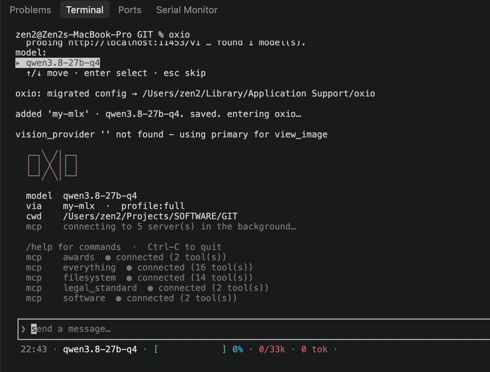
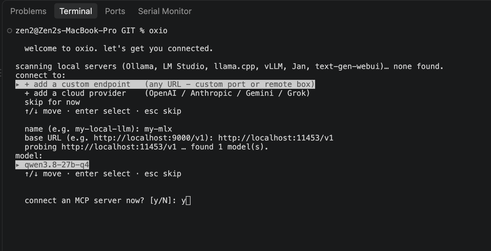
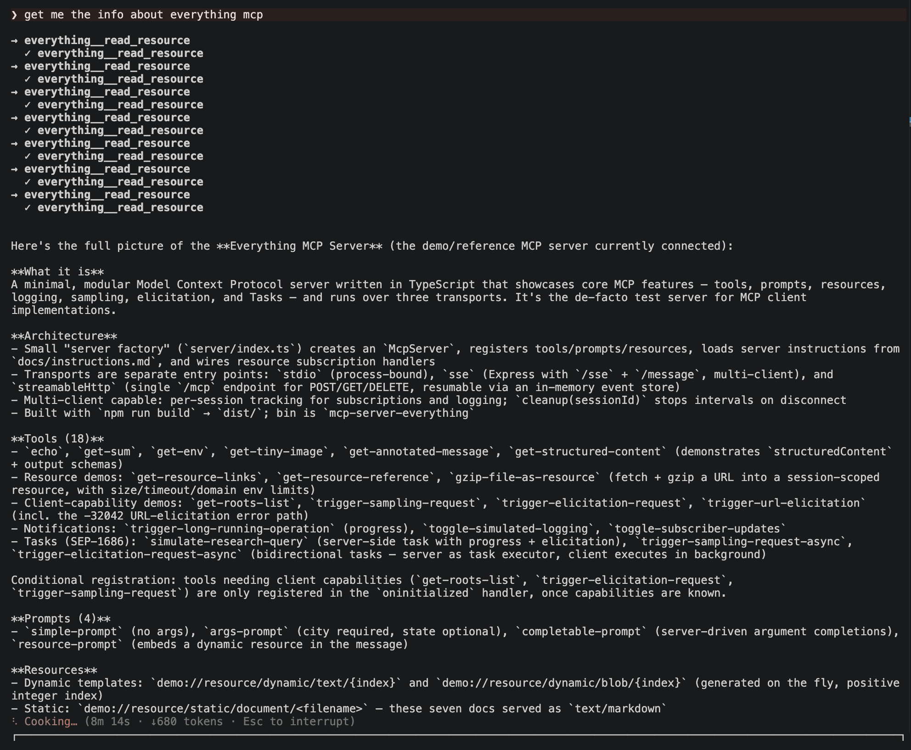

# oxio

Local-first AI coding agent for the terminal - runs on your own models.

[](LICENSE)

Point oxio at a model you run yourself (Ollama, LM Studio, llama.cpp, MLX, vLLM, or any
OpenAI-compatible server), or at a cloud vendor when you want one. Config, keys, and
history stay on your machine.



## Features

- Local-first: runs against your own endpoints by default, no account required to start
- Any OpenAI-compatible endpoint, plus Anthropic and Responses wire formats
- Multi-machine fallback: rolls to the next live endpoint, reaching a paid vendor only if every local box is down
- Full TUI: streaming output, status line, write-permission prompts, session resume, arrow-key connect picker
- Tools that work on a text-only model: file read/write, patch editing, search, shell (OS-sandboxed on macOS), document text extraction (PDF/DOCX/XLSX), image input routed to a vision provider
- MCP client and configurable named sub-agents
- VS Code companion: send the editor selection as context, approve file changes in a native diff

## Supported providers

**Local**

- Ollama, LM Studio, llama.cpp, MLX, vLLM, Jan, text-generation-webui
- Any other OpenAI-compatible server (custom host/port)

**Cloud**

- OpenAI, Anthropic, Google Gemini, xAI Grok

## Installation

Install the latest release with one command (prebuilt binary, no Rust toolchain):

```bash
curl -LsSf https://limkc.com/oxio | sh
```

Or install straight from GitHub Releases:

```bash
curl -LsSf https://github.com/limkcreply/oxio/releases/latest/download/oxio-installer.sh | sh
```

This puts the `oxio` binary on your PATH. Run your own model endpoint separately (for
example Ollama on `localhost:11434`).

### From source

Requires a Rust toolchain.

```bash
git clone https://github.com/limkcreply/oxio
cd oxio
cargo install --path crates/oxio
```

## First run

With no config, oxio scans the well-known local servers and shows a picker:

```bash
oxio
```

Arrow-select a model to connect, or add a custom endpoint (any host/port) or a cloud
provider.



## Usage

```bash
oxio                 # interactive session
oxio "a prompt"      # one-shot
oxio --continue      # resume the latest session
oxio doctor          # check endpoints, config, and connected MCP servers
```



In a session:

```
/model                              switch endpoint or model (arrow-pick)
/model add <name> <url> [model]     register any endpoint
/model cloud [vendor]               add a cloud provider
/think on|off|auto                    toggle model reasoning
/compact                              summarize the session to reclaim context
/help                                 full command list
```

## Configuration

Config lives in oxio's config directory, human-editable and kept in sync with the
`oxio config` and `oxio provider` commands:

- Linux: `~/.config/oxio/`
- macOS: `~/Library/Application Support/oxio/`

`config.toml` and your `.env` both live there. Run `oxio config path` to print the exact
location on your machine.

```toml
[defaults]
primary = "my-local-llm"

[providers.my-local-llm]
wire_api = "chat_completions"
base_url = "http://localhost:11434/v1"
model = "qwen2.5-coder:14b"
auth = "none"
```

Secrets never go in the config file. Cloud API keys are read from the environment (or a
`.env` beside the config), referenced by provider name.

Optional sections: `[providers.*]`, `[profiles.*]`, `[models.*]`, `[mcp.*]`, `[agents.*]`,
`[lsp.*]`, `[skills.*]`, `[hooks]`, `[pricing.*]`, and a `statusline` template.

## VS Code

oxio ships a companion extension. Run oxio in VS Code's integrated terminal and it offers to
install it on the first run, then asks you to reload the window. The extension is bundled in
the binary, so nothing is downloaded. Installing it needs the `code` command on your PATH.

With the extension active:

- Text selected in the editor rides along with your next prompt, shown as a
  `Selected 12 lines from src/main.rs` chip.
- A file change opens as a native VS Code diff. Accept it with `cmd+enter` or reject it with
  `escape`, or answer the `y/N` prompt in the terminal instead. Whichever you answer first wins.

The extension talks to oxio over a loopback MCP server bound to `127.0.0.1`, and serves the
current selection and the diff decision to oxio. It exposes nothing else.

## Project instructions

Add an `AGENTS.md` or `OXIO.md` to a project (or your config dir) and oxio appends it to
the system prompt, so the agent knows that project's conventions.

## License

Apache-2.0. See [LICENSE](LICENSE).
